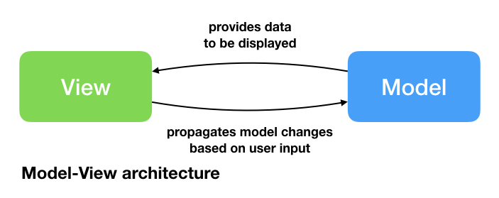
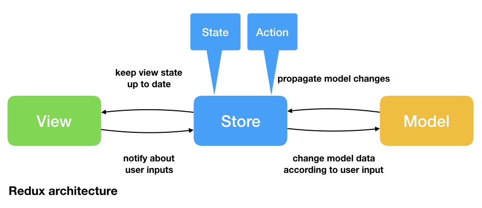

# SwiftUI Architectures: Model-View, Redux & ViewState MVVM

This repository contains implementations of a simple chat client called QBChat. Each implementation uses SwiftUI while applying a different architecture (Model-View, Redux & ViewState MVVM). 
More explanation about each SwiftUI architecture example can be found in [this blog article](https://quickbirdstudios.com/blog/swiftui-architecture-redux-mvvm/). 
Currently, QBChat is implemented using the following app architectures:

### Model-View

The Model-View architecture does not enforce abstraction of business logic from Views similar to the MVC architecture pattern with UIKit.

### Redux

In [Redux-like architectures](https://redux.js.org), a global state is used to ensure consistency across all Views being kept in Stores. View components can trigger Actions which are interpreted into state changes by a reducer.

### ViewState MVVM

ViewState MVVM uses separate ViewModels for each View (if required). Instead of a global state and global actions, ViewState MVVM creates a separate ViewModel interface for each View containing a State and different Inputs.

## Author

SwiftUI-Architectures is created with ❤️ by [QuickBird Studios](https://quickbirdstudios.com).

To get more information on the different app architectures check out [our blog post](https://quickbirdstudios.com/blog/swiftui-architecture-redux-mvvm/).

## Contributing

Open an issue if you need help, if you found a bug, or if you want to discuss a feature request.

Open a PR if you want to add other SwiftUI app architectures to the repository or make changes to the different implementations.

## License

SwiftUI-Architectures is released under an MIT license. See [License.md](https://github.com/quickbirdstudios/SwiftUI-Architectures/blob/master/LICENSE) for more information.
